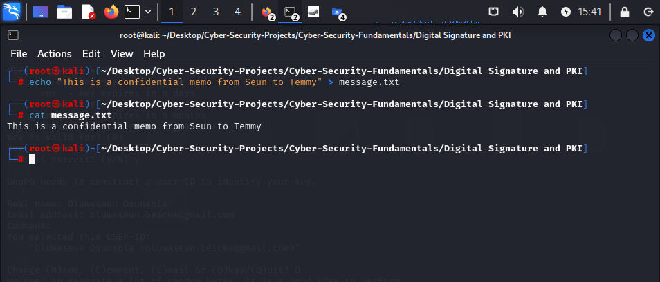
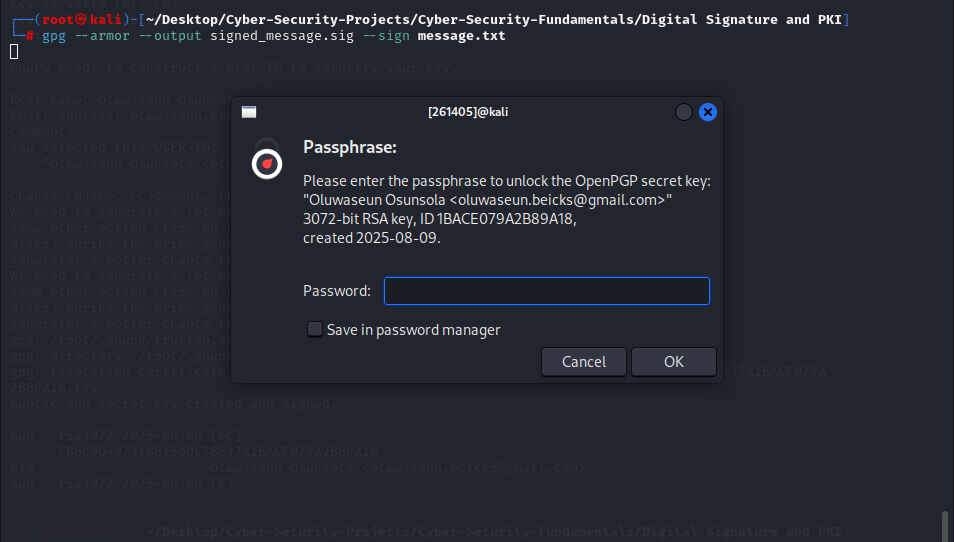
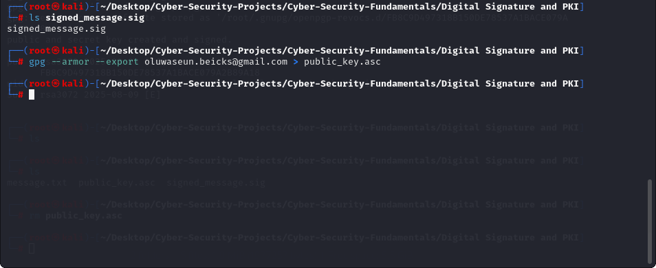
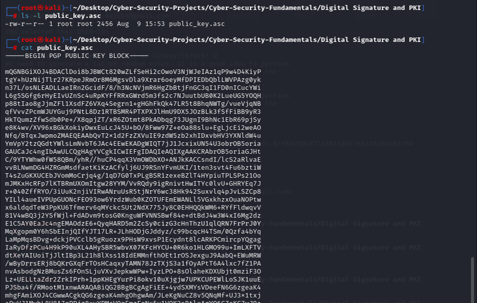
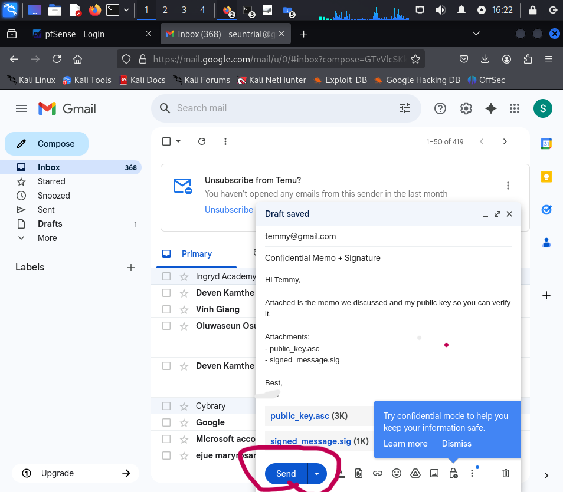
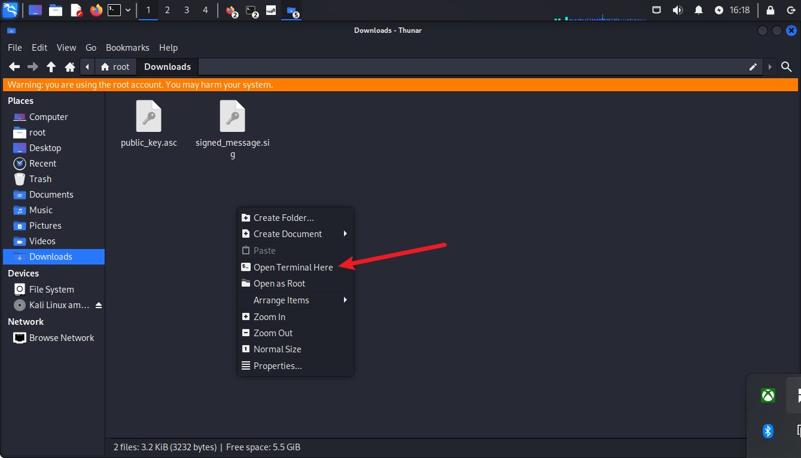
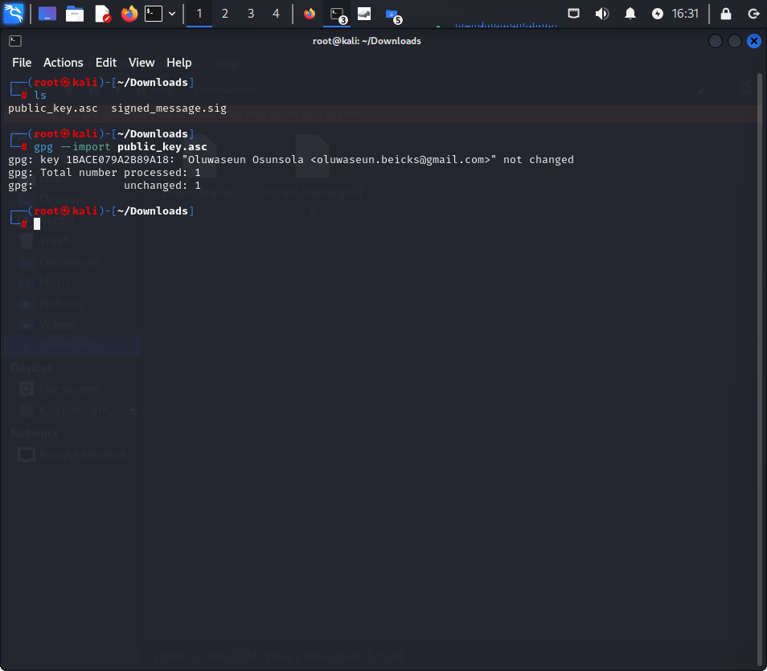
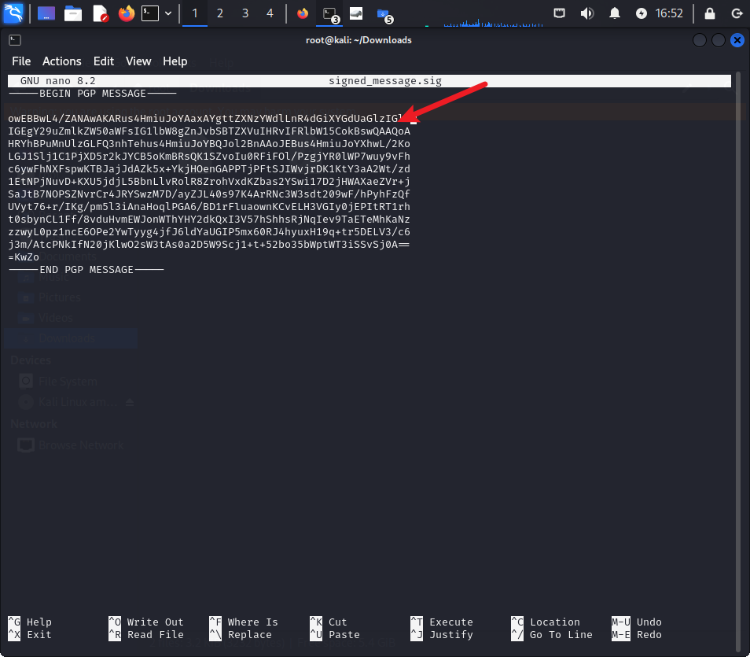
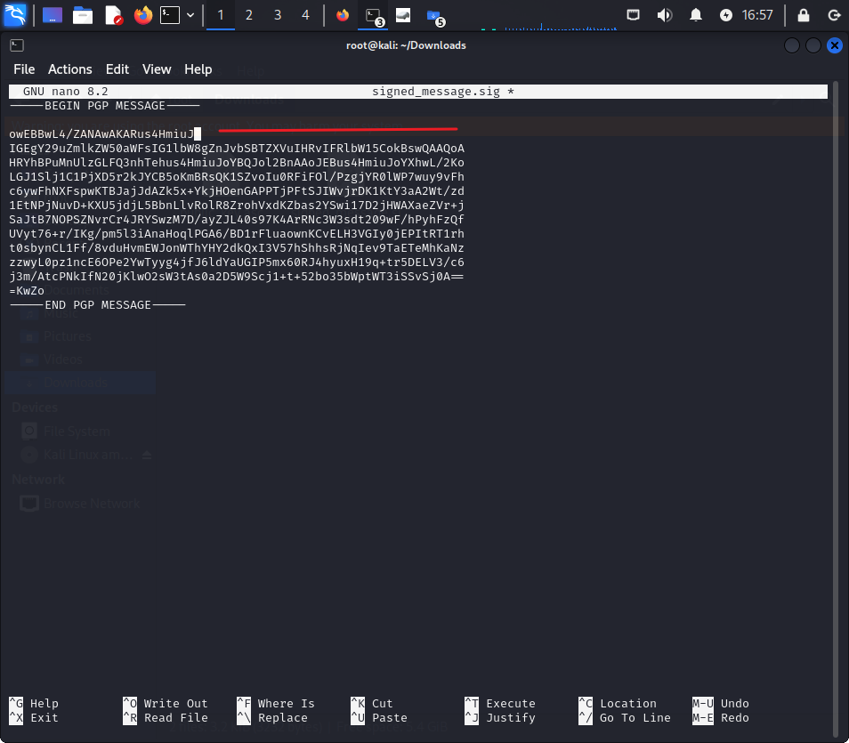
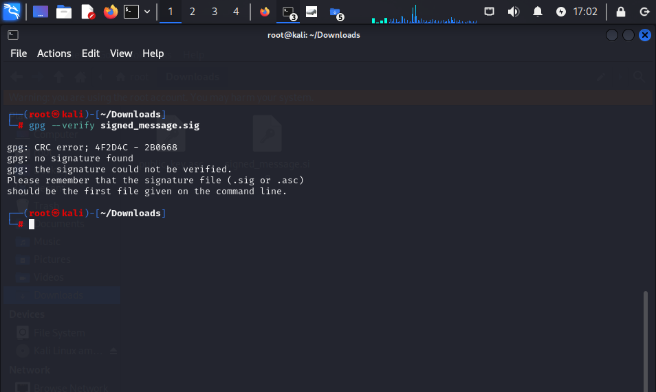

# Understanding and Implementing Digital Signatures and Public Key Distribution

**Author:** Oluwaseun Osunsola  
**Environment:** Kali Linux (CLI-based)  
**Project link:** https://github.com/Oluwaseunoa/Cyber-Security-Projects/tree/main/Cyber-Security-Fundamentals/Digital-Signature-and-PKI

## 📜 Background  
In cybersecurity, ensuring that a file or message has not been altered during transmission is critical. Digital signatures, created using private keys and verified using public keys, provide this assurance. GPG (GNU Privacy Guard) is an open-source encryption tool that implements the OpenPGP standard for securing data.

## 🎯 Scope

Key Management: Importing the sender's public key into the local keyring.

File Handling: Ensuring that the signed message and its corresponding signature file are correctly prepared.

Signature Verification: Using GPG to check both the validity and integrity of the signed data.

Error Handling: Diagnosing common errors (e.g., CRC errors, “no signature found”) and understanding their causes.

## 📌 Project Objective
The goal of this project is to:
- Understand how **digital signatures** work.
- Learn how to **generate key pairs** using GPG.
- Sign and verify messages using public–private key cryptography.
- Share public keys securely.
- Test the integrity verification feature by detecting tampered messages.

---

## 🛠 Tools Used
- **Operating System:** Kali Linux  
- **Software:** GPG (GNU Privacy Guard)  
- **Text Editor:** nano  
- **Terminal:** Bash Shell

---

## 📂 Project Structure
```

Digital-Signature-and-PKI/
├── img/                          # All project screenshots
├── Temmy_Download/               # Files that Temmy received
├── message.txt                   # Original message file
├── public_key.asc                # Exported public key
├── README.md                     # This project report
└── signed_message.sig            # Signed message file


````

---

## 🧩 Project Steps

### **Step 1: Generate a GPG Key Pair**
We start by generating a public–private key pair.  
Command:
```bash
gpg --full-generate-key
````


---

### **Step 2: Choose Key Length**

For stronger encryption, `4096` bits should be chosen but we'll go with the default 3072 bits.


---

### **Step 3: Set Key Validity Period**

We set the key to be forever valid by choosing **0**.


---

### **Step 4: Identity Construction**

We provided:

* Name: Oluwaseun Osunsola
* Email: `oluwaseun.beicks@gmail.com` 
  

---

### **Step 5: Final Options and Passphrase Choice**

We confirmed the key type, length, validity, and then set a strong passphrase to protect the private key.


---

### **Step 6: Create a Message**

We created a text file with a confidential message:

```bash
echo "This is a confidential memo from Seun to Temmy" > message.txt
cat message.txt
```



---

### **Step 7: Sign the Message**

We signed the message using:

```bash
gpg --armor --output signed_message.sig --sign message.txt
```

This produced a `.sig` file containing the message and its signature.


---

### **Step 8: List Keys**

To confirm our key exists in the local GPG keyring:

```bash
gpg --list-keys
```


---

### **Step 9: Export Public Key**

We exported the public key linked to our email:

```bash
gpg --armor --export oluwaseun.beicks@gmail.com > public_key.asc
```



---

### **Step 10: Verify the Key Export**

We checked that the `public_key.asc` file exists and contains the ASCII-armored key.


---

### **Step 11: Send Files to Receiver**

We sent **two files** to Temmy (acting as Alice in this simulation):

* `public_key.asc`
* `signed_message.sig`
  

---

## 🧩 Receiver's (Temmy’s) Steps

### **Step 12: Download Files**

Temmy downloads both files into her `Downloads` folder.


---

### **Step 13: Open Downloads Folder in Terminal**

She navigates to the Downloads folder via terminal.


---

### **Step 14: Import Public Key**

Temmy imports Oluwaseun’s public key:

```bash
gpg --import public_key.asc
```



---

### **Step 15: Verify the Signature**

Temmy verifies that the signed file was indeed signed by Oluwaseun:

```bash
gpg --verify signed_message.sig
```


---

## 🔍 Integrity Testing

### **Step 16: Open Signed Message**

Temmy opens the signed file in nano.


---

### **Step 17: View Signed Message Content**

The content is in ASCII-armored format (encoded and compressed message + signature).


---

### **Step 18: Tamper with the File**

Temmy deletes some characters from the encoded message block.


---

### **Step 19: Verify Again — Failure**

After tampering, GPG detects corruption:

```bash
gpg --verify signed_message.sig
```

Output:

```
gpg: CRC error...
gpg: the signature could not be verified.
```



This confirms that **any alteration** to the signed content invalidates the signature.

---

## 📊 Learning Outcomes

* Learned how to **generate GPG keys** securely.
* Understood **public–private key encryption** and **digital signatures**.
* Practiced **signing** and **verifying** messages.
* Understood the importance of **key sharing** and **integrity verification**.
* Saw how **tampering** invalidates a signature.

---

## 💡 Real-World Applications

* **Secure email signing** (PGP, S/MIME)
* **Software distribution** (verifying signed binaries)
* **Git commit signing** (to prevent commit forgery)
* **Document authenticity checks** (contracts, agreements)

---


