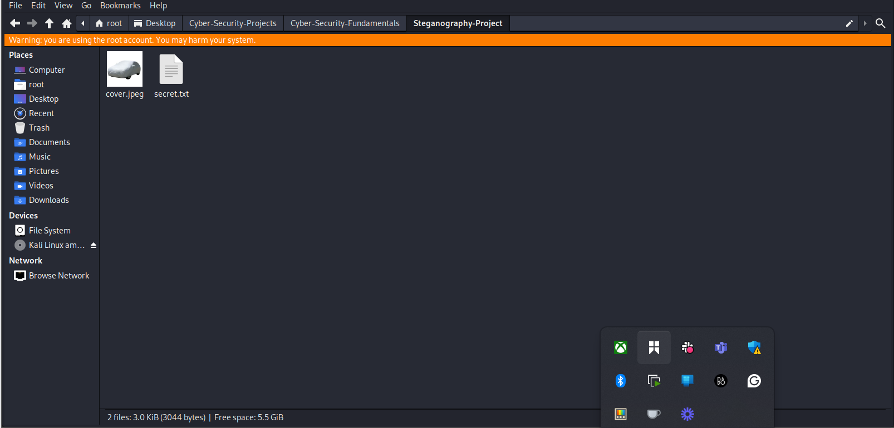
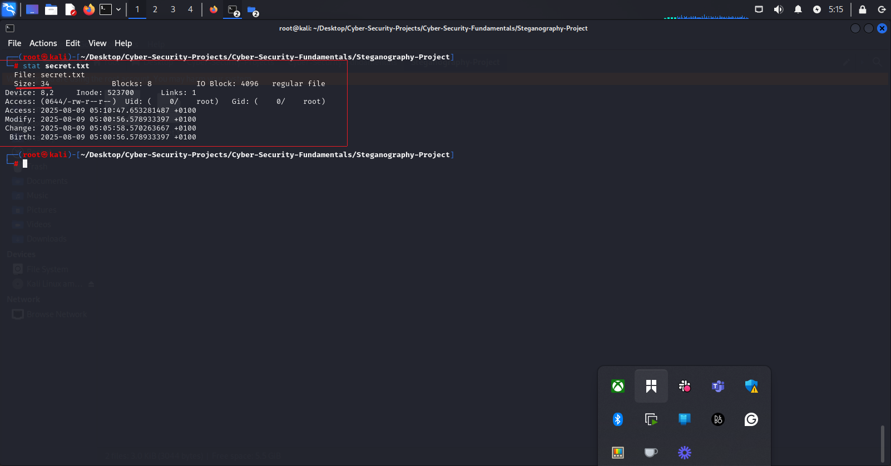
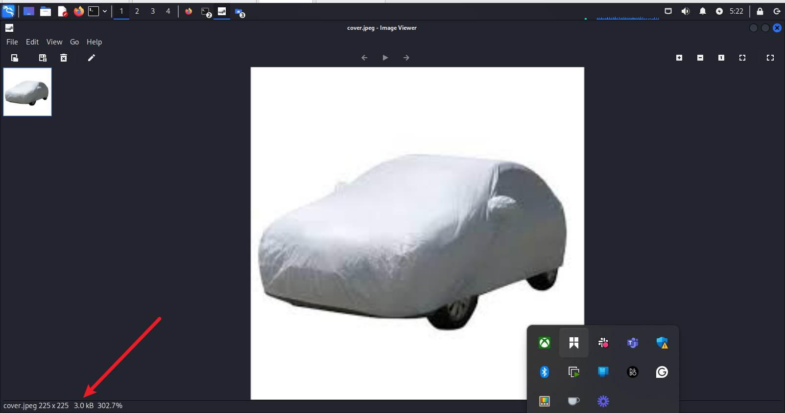
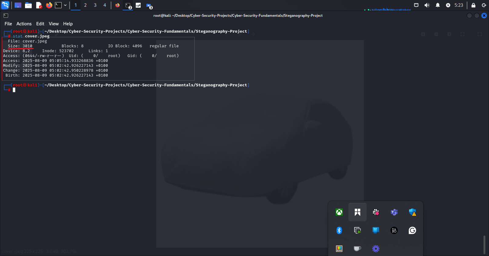
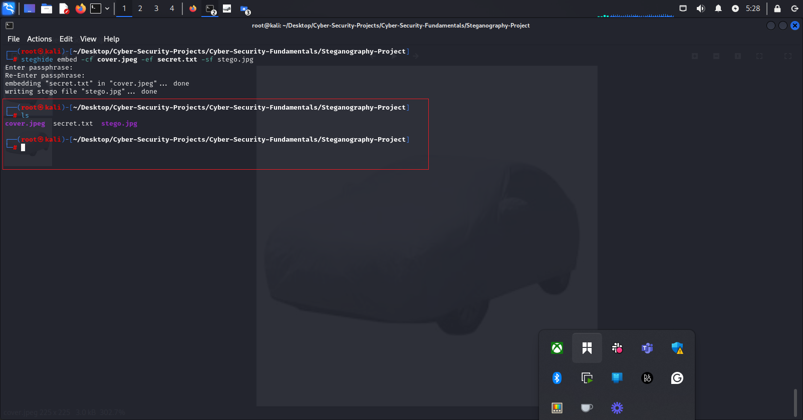
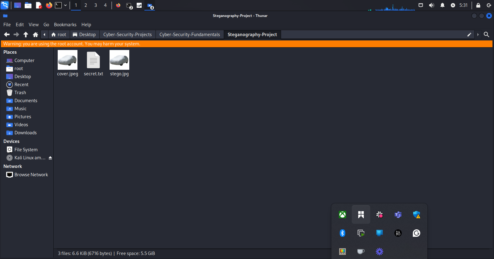
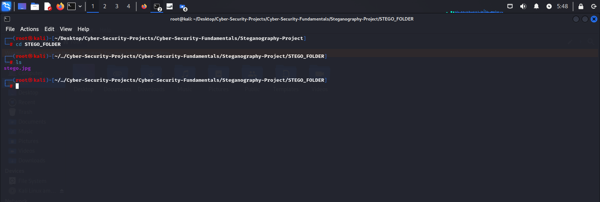

# Steganography Project — Hiding Information in Plain Sight

**Author:** Oluwaseun Osunsola  
**Environment:** Kali Linux (CLI-based)  
**Project link:** https://github.com/Oluwaseunoa/Cyber-Security-Projects/tree/main/Cyber-Security-Fundamentals/Steganography-Project

---

## 1. Project Overview
This project demonstrates the process of **digital steganography** — hiding information within a seemingly normal file — using **Steghide**. For this demonstration, a Linux Debian-based distribution called **Kali Linux** was used.

We embed a text file (`secret.txt`) into a JPEG image (`cover.jpeg`) without changing the visible appearance of the image. The hidden message can only be retrieved with the correct passphrase.  

**Key Objectives:**
- Show how Steghide can hide a file inside an image.
- Verify that the stego image looks identical to the original.
- Extract the hidden message to confirm successful embedding.
- Discuss security implications and ethical considerations.

---

## 2. Folder Structure
```

Steganography-Project/
│
├── cover.jpeg              # Carrier image
├── secret.txt              # File to be hidden
├── img/                    # Screenshots of the process
│   ├── 1.project_folder_on_cli.png
│   ├── 2.project_folder_in_gui.png
│   ├── 3.open_secret-txt.png
│   ├── 4.stat_secret-txt_before_steg.png
│   ├── 5.open_cover-jpeg.png
│   ├── 6.stat_cover-jpeg.png
│   ├── 7.steg_command.png
│   ├── 8.steg-jpg_creation_confirmed_cli.png
│   ├── 9.steg-jpg_creation_confirmed_gui.png
│   ├── 10.open_stego-jpg.png
│   ├── 11.compare_size_and_hash_digest_of_cover-jpeg_with_stego-jpeg.png
│   ├── 13.navigate_to_new_the_STEGO_FOLDER.png
│   ├── 11.compare_size_of_cover-jpeg_with_stego-jpeg.png
│   ├── 12.move_stego-jpg_to_new_subfolder.png
│   └── 13.navigate_to_new_the_STEGO_FOLDER.png
│   └── 14.extract_stego-jpg.png
└── STEGO_FOLDER           # Output folder for stego image & extracted files
├── README.md              # Project documentation file

````

---

## 3. Tools Used
- **Kali Linux** (pre-installed with Steghide)
- **Steghide** (command-line steganography tool)
- Basic Linux utilities (`ls`, `stat`, `cat`)

**Verify Steghide is installed:**
```bash
steghide --version
````

---

## 4. Step-by-Step Implementation

### Step 1 — Navigate to Project Folder to see the starting files (CLI)

```bash
cd ~/Desktop/Cyber-Security-Projects/Cyber-Security-Fundamentals/Steganography-Project
ls
tree
```


---

### Step 2 — Confirm Files in GUI



---

### Step 3 — Open `secret.txt` in nano

```bash
nano secret.txt
```


---

### Step 4 — Check Properties of `secret.txt`

```bash
stat secret.txt
```



---

### Step 5 — Open `cover.jpeg`



---

### Step 6 — Check Properties of `cover.jpeg`

```bash
stat cover.jpeg
```



---

### Step 7 — Embed `secret.txt` Inside `cover.jpeg`

```bash
steghide embed -cf cover.jpeg -ef secret.txt -sf stego.jpg
```

* **`-cf`**: cover file (image)
* **`-ef`**: embedded file (secret)
* You will be prompted for a **passphrase**. Remember it for extraction.


---

### Step 8 — Confirm Stego Image Creation (CLI)

```bash
ls 
```



---

### Step 9 — Confirm Stego Image Creation (GUI)



---

### Step 10 — Open Stego Image

Visually inspect — no difference from original.


---

### Step 11 — Compare Sizes and File Hash Digest for cover.jpeg and stego.jpg
```bash
stat cover.jpeg 
sha256sum cover.jpeg
```
```bash
stat stego.jpg
sha256sum stego.jpg
```


#### Expected Output:

```
File: cover.jpeg
Size: 3010 bytes
SHA256sum Hash: c0b3b45c11546813d8f08de9b2e1606bc92e8f6d4b5b84228ce0da32f0effb1b
```
```
File: stego.jpg
Size: 3672 bytes
SHA256sum Hash:
19ae28125a85e6146c5043aada45fcdbab24662dff1e46e1587df6c0af5c8726

```

Observe that the size and hash values are different, indicating that stego.jpg has been modified to contain hidden data.


### Step 12 – Organize the stego file for extraction

I created a **`STEGO_FOLDER`** for better file management, moved `stego.jpg` into it, and used the `tree` command in **Steganography-Project** directory to confirm its new location in preparation for extraction.

**Commands used:**

```bash
mkdir STEGO_FOLDER
mv stego.jpg ./STEGO_FOLDER
tree
```

**Expected output:**

```
Steganography-Project
├── README.md
├── original.jpg
├── secret.txt
└── STEGO_FOLDER
    └── stego.jpg
```


---

### Step 13 — Navigated STEGO_FOLDER to extract Hidden Message

```bash
# from Steganography-Project to STEGO_FOLDER

cd STEGO_FOLDER   
```
```bash
#Extract stego.jpg file

steghide extract -sf stego.jpg 
```
* **`-sf`**: stego file
* Enter the passphrase used during embedding.
* `secret.txt` will be recovered in the current directory.



---

## 5. Observations

* Stego image **looks identical** to original, but file size is slightly larger.
* Without the correct passphrase, the secret cannot be extracted.
* Steghide automatically encrypts the embedded file for extra security.

---

## 6. Ethical Considerations

Steganography is a powerful tool but can be abused.
**Legitimate uses:**

* Secure communication in hostile environments.
* Watermarking and copyright protection.

**Risks:**

* Concealing malicious payloads.
* Evading digital forensics.

---

## 7. References

* [Steghide Documentation](http://steghide.sourceforge.net/documentation.php)
* Provos, N., & Honeyman, P. (2003). *Hide and Seek: An Introduction to Steganography*. IEEE Security & Privacy.

