# Vulnerable Java Application Basic Application Security Testing
**Author:** Oluwaseun Osunsola  
**Environment:** Windows GUI and CLI   

**Project link:** https://github.com/Oluwaseunoa/Cybersecurity-Projects/tree/main/Static-Application-Security-Testing/SAST101-Vulnerable-Java-Application%20Test

## Background
Static Application Security Testing (SAST) is a critical practice in modern software development, aimed at identifying security vulnerabilities in source code early in the development lifecycle. By analyzing code without executing it, SAST tools like SonarCloud can detect issues such as SQL injection, insecure dependencies, and code smells that could lead to exploitable weaknesses. The rise of DevSecOps has emphasized integrating security practices into continuous integration and continuous deployment (CI/CD) pipelines, enabling developers to address vulnerabilities proactively.

This project focuses on a vulnerable Java application, a common target for security testing due to Java’s widespread use in enterprise applications. The application, sourced from a public GitHub repository, was deliberately chosen for its known vulnerabilities to demonstrate the effectiveness of SAST in identifying security flaws. By leveraging SonarCloud for code analysis, GitHub for version control, and AWS CodeBuild for automation, the project showcases a practical approach to integrating SAST into a DevSecOps pipeline. The setup ensures scalability, repeatability, and alignment with industry-standard security practices.

## Objective
The primary objective of this project is to implement a basic SAST pipeline to analyze a vulnerable Java application for security vulnerabilities and code quality issues. Specific goals include:

1. **Identify Security Vulnerabilities**: Use SonarCloud to detect critical issues such as SQL injection risks, insecure dependencies, and other code-level vulnerabilities in the Java application.
2. **Establish a DevSecOps Pipeline**: Integrate GitHub as the source repository with AWS CodeBuild to automate the build and scanning process, ensuring seamless interaction with SonarCloud.
3. **Document the Process**: Provide a comprehensive, step-by-step guide supported by screenshots to ensure reproducibility and serve as a reference for future SAST implementations.
4. **Demonstrate Practical Application**: Showcase how SAST can be applied in a real-world scenario to improve code security and align with DevSecOps principles.
5. **Provide Actionable Insights**: Generate a detailed analysis report with metrics on vulnerabilities, security hotspots, and code coverage to guide remediation efforts.

By achieving these objectives, the project aims to demonstrate the value of automated security testing in enhancing the security posture of software applications while maintaining development efficiency.

## Executive Summary  
This project focuses on performing basic Static Application Security Testing (SAST) on a vulnerable Java application using SonarCloud as the primary analysis tool. The application source code was sourced from GitHub, and AWS CodeBuild was utilized to automate the build and scanning process. The goal was to identify security vulnerabilities in the Java code through automated scanning, demonstrating a simple DevSecOps pipeline integration.

Key tools and services used:    
- **SonarCloud**: For code quality and security analysis.    
- **GitHub**: As the repository source and version control system.    
- **AWS CodeBuild**: For building the project and integrating with SonarCloud.    

The project involved setting up a SonarCloud organization and project, generating access tokens, cloning and preparing the vulnerable Java repository, connecting GitHub to AWS, and running a build to trigger the SonarCloud scan. The results highlighted vulnerabilities in the code, providing insights for remediation.

## Project Structure
The project directory structure is as follows:

```
C:.
└───SAST101-Vulnerable-Java-Application Test
    ├───app
    │   └───.jdk
    │       └───bin
    ├───gradle
    │   └───wrapper
    ├───img
    └───src
        └───main
            └───java
```

This structure indicates a Gradle-based Java application, with source code in `src/main/java`, build tools in `gradle`, and an embedded JDK in `app/.jdk`. The `img` folder contains screenshots documenting the execution steps.

## Step-by-Step Execution  
The project was executed in a sequential manner, starting with SonarCloud setup, followed by repository preparation on GitHub, and concluding with AWS CodeBuild integration and scanning. Each step is described below, with references to the corresponding screenshot in the `img` folder. The screenshot filenames directly describe the actions taken.

1. **Navigate to SonarCloud Login Page**:   
Accessed the SonarCloud website to begin the setup process.  
   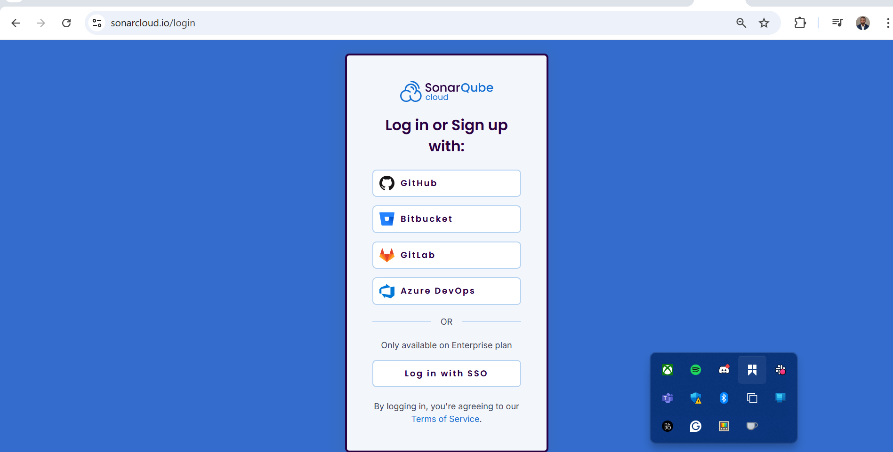

2. **Sign In with GitHub**:   
Selected GitHub as the authentication method for SonarCloud login.  
   

3. **Create Organization at Welcome Screen**:   
On the welcome screen, clicked the plus icon to create a new organization.  
   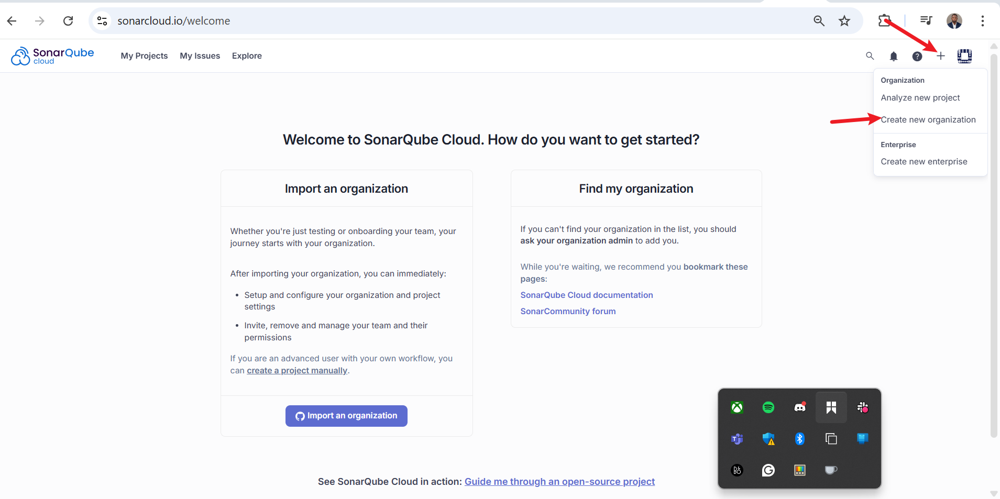

4. **Create Organization Manually**:   
At the organization creation page, opted to create one manually.  
   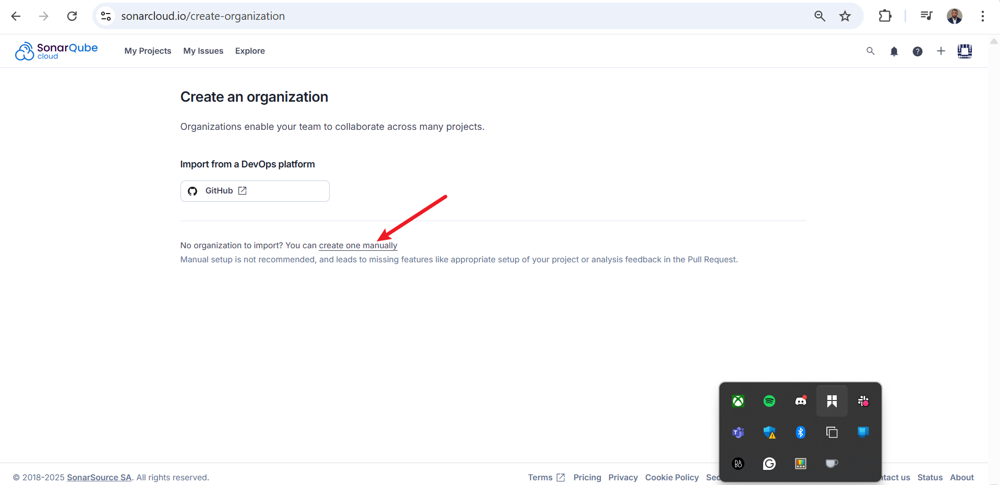

5. **Choose Organization Name and Key**:  
Entered the organization name and key for identification.  
   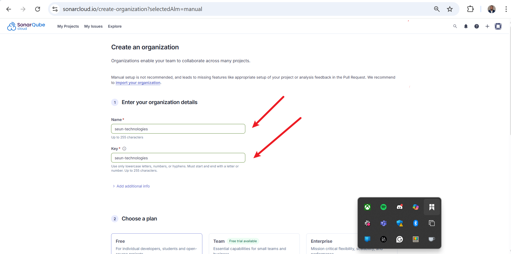

6. **Select Free Plan and Create Organization**:   
Chose the free plan and finalized organization creation.  
   

7. **Create Project in the Organization**:   
Within the newly created organization, initiated project creation.  
   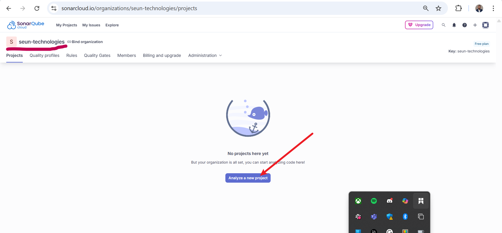

8. **Create Project Manually**:   
Selected the manual option for project setup.  
   

9. **Choose Display Name, Project Key, and Set to Public**:   
Specified the display name, project key, and set visibility to public.  
   

10. **Select Previous Version and Click Create Project**:   
Chose the previous version option and created the project.  
    

11. **Click on Account and My Account**:   
Accessed the account settings by clicking on the account menu and selecting "My Account".  
    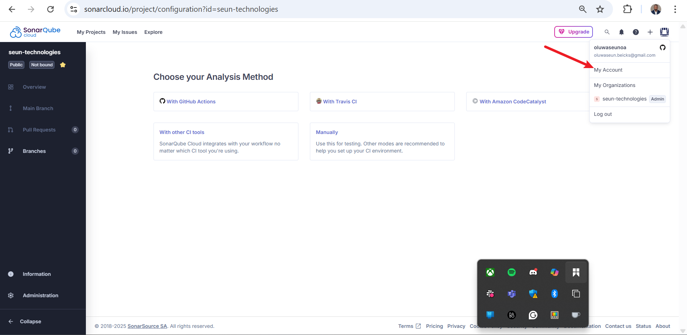

12. **Click on Security**:   
Navigated to the security section in account settings.  
    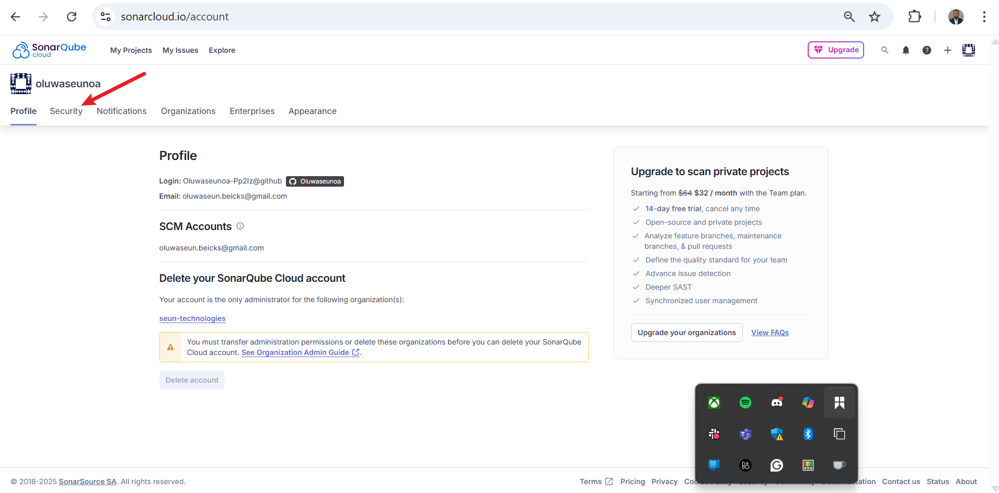

13. **Enter Name, Generate Token, and Copy Generated Token**:   
Provided a name for the token, generated it, and copied the value.  
    

14. **Copy Generated Token (Not Visible Again)**:   
Noted and copied the token, as it would not be displayed again.  
    

15. **Locate Vulnerable Code Repository on GitHub and Copy HTTPS Link**:   
Found the vulnerable Java repository on GitHub and copied its HTTPS clone link.  
    

16. **Navigate to Desired Location and Clone Repository**:   
Moved to the local directory and cloned the repository using the copied link.  
    

17. **Create Project Folder**:   
Set up a new folder for the project.  
    

18. **Copy Content of Cloned Repository into Project Folder**:   
Transferred the cloned repository contents into the new project folder.  
    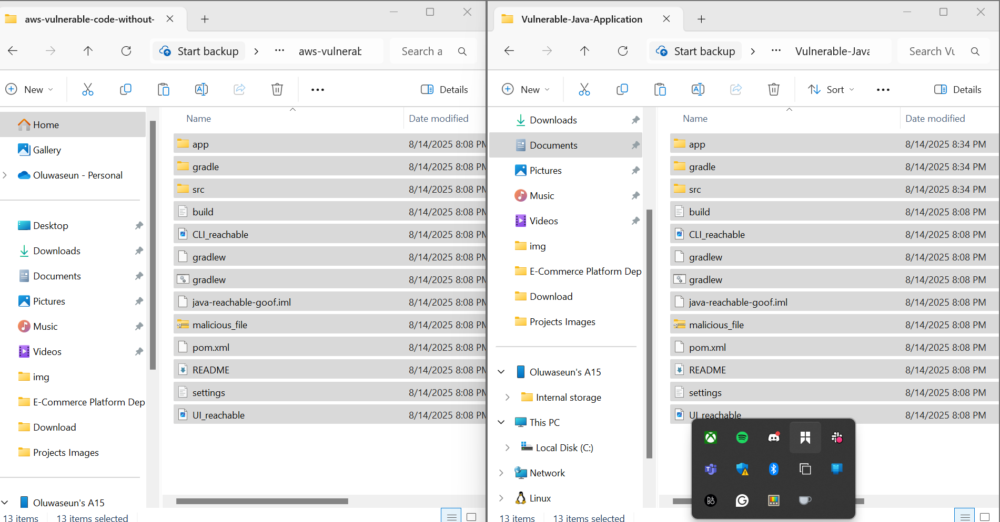

19. **Create Repository in the Name of Project Folder on GitHub**:   
Created a new GitHub repository matching the project folder name.  
    

20. **Copy Repository Link from Quick Setup Section**:   
Copied the new repository's link from the quick setup area.  
    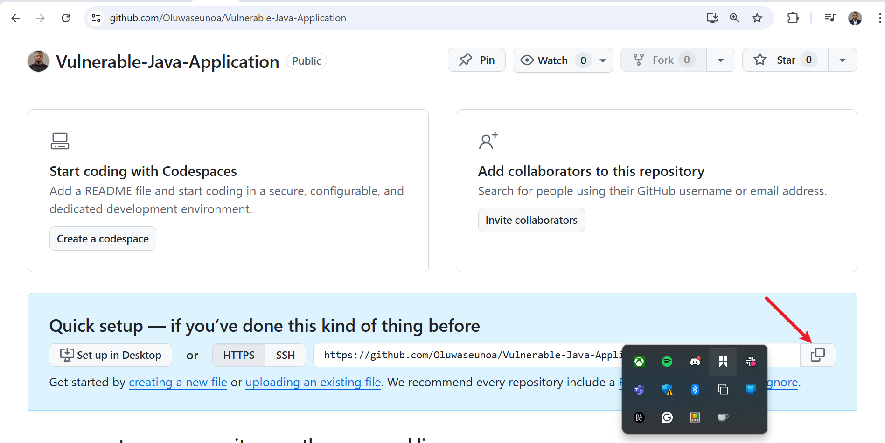

21. **Initialize, Stage, Commit, and Push Repository to GitHub**:   
Initialized Git, staged files, committed changes, and pushed to the new GitHub repository.  
    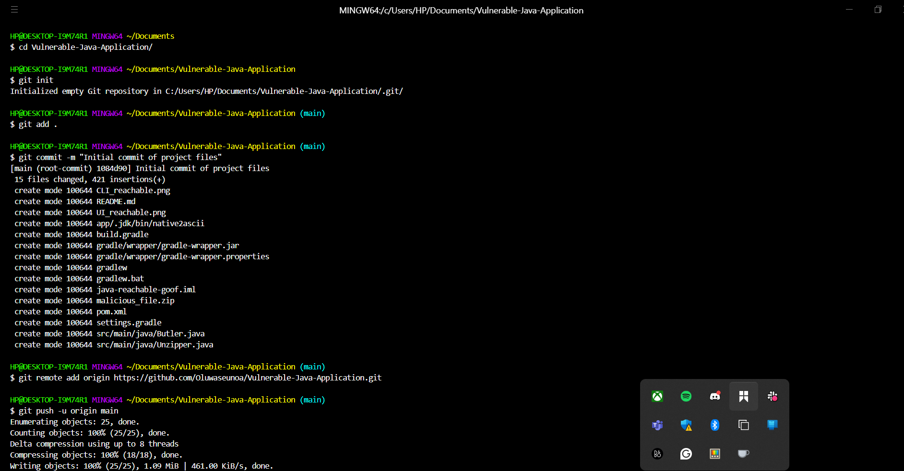

22. **Reload GitHub to Confirm Upload**:   
Refreshed the GitHub page to verify the upload was successful.  
    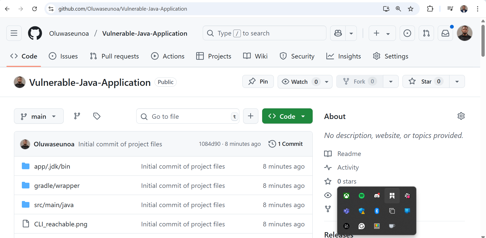

23. **Log In to AWS Console**:   
Accessed the AWS Management Console with credentials.  
    

24. **Search for CodeBuild and Click on It**:   
Searched for "CodeBuild" in the AWS services and selected it.  
    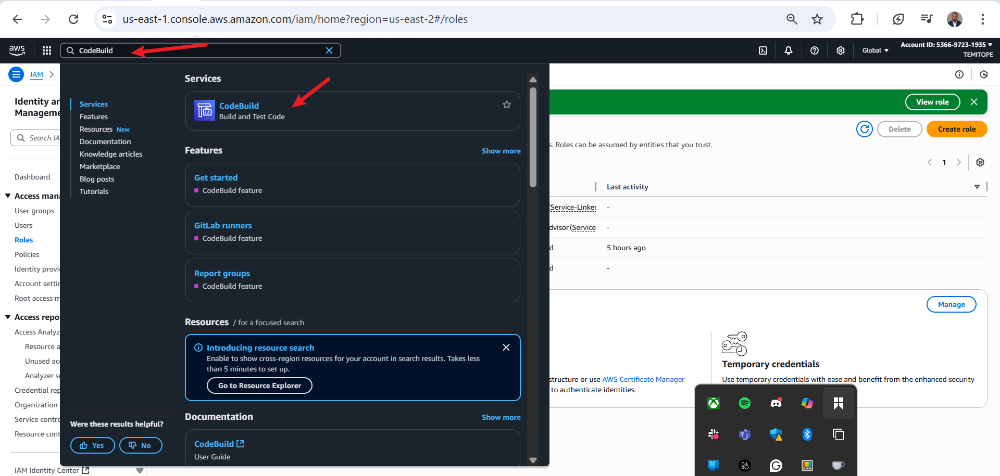

25. **Click on Create Project**:   
Initiated the creation of a new build project.  
    

26. **Name the Project and Scroll Downward**:   
Assigned a name to the project and proceeded downward.  
    

27. **Select GitHub as Source Provider and Click on Manage Credentials**:  
Chose GitHub as the source and managed credentials.  
    

28. **Click Create New GitHub Connection**:   
Started the process to create a new connection to GitHub.  
    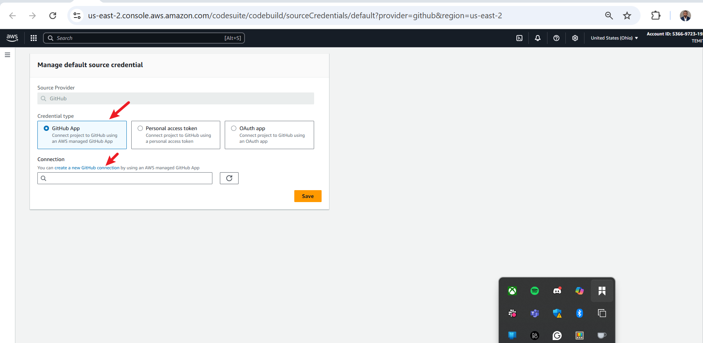

29. **Create GitHub App Connection**:   
Set up the GitHub app connection.  
    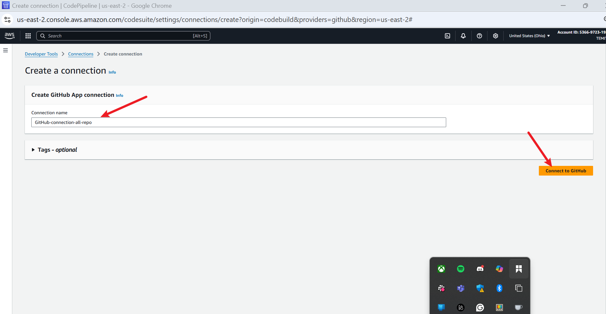

30. **Click Connect to GitHub**:   
Connected the AWS account to GitHub.  
    

31. **Click Install a New App**:   
Installed a new GitHub app for integration.  
    

32. **Click on GitHub Profile with Username**:   
Selected the GitHub profile associated with the account username.  
    

33. **Authorize for All Repositories or Some**:   
Granted authorization for all or selected repositories.  
    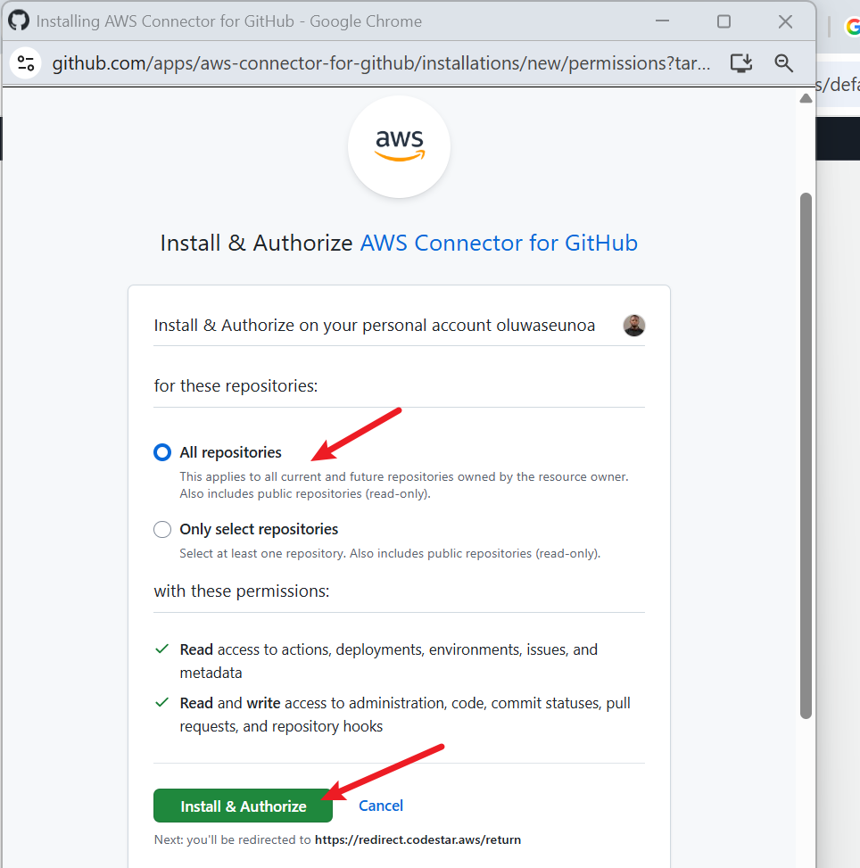

34. **Authenticate with Device (If 2FA Enabled)**:   
Completed device authentication for two-factor setup.  
    

35. **Confirm Identity by Supplying Number Sent**:   
Entered the verification code sent for identity confirmation.  
    

36. **Click Connect After App Installation**:   
Finalized the connection post-installation.  
    

37. **Select the New Connection**:   
Chose the newly created GitHub connection.  
    

38. **Click Save**:   
Saved the connection settings.  
    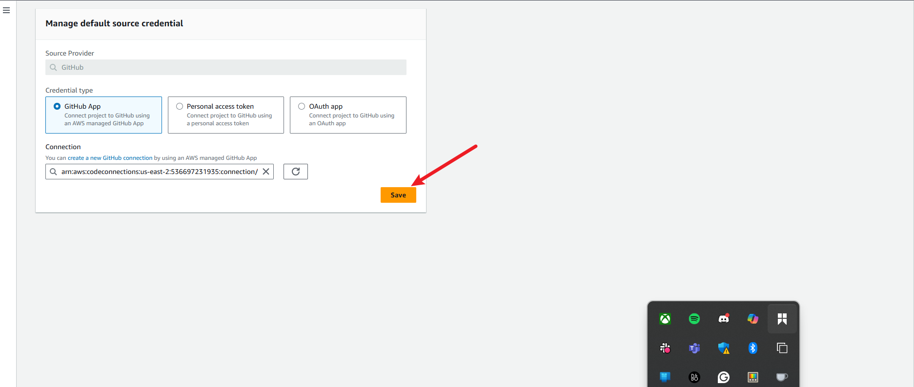

39. **Account Now Connected to GitHub**:   
Confirmed the successful connection between AWS and GitHub.  
    

40. **Select from GitHub Repository and Choose Your Repository**:   
Picked the project repository from the GitHub sources.  
    

41. **Leave Default OS Type and Spec**:   
Retained the default operating system type and specifications for the build environment.  
    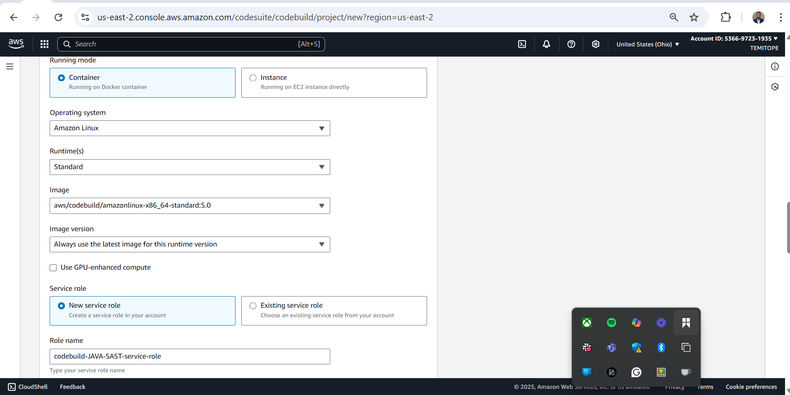

42. **Leave Default System and Runtime Under Environment**:   
Kept the default system and runtime settings in the environment configuration.  
    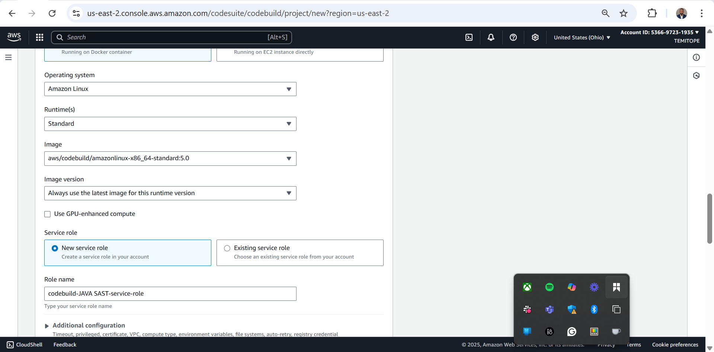  <!-- Note: Filename appears to have a typo in "system" -->

43. **Under Buildspec, Select Insert Build Command and Switch to Editor**:   
In the buildspec section, chose to insert commands and switched to the editor mode.  
    

44. **Paste Commands to the Text Editor**:   
Inserted the necessary build commands into the editor.  Find it [here](https://github.com/asecurityguru/aws-devsecops-repo-for-buildspec-with-sonarcloud-actualvalues/blob/main/buildspec.yml)
    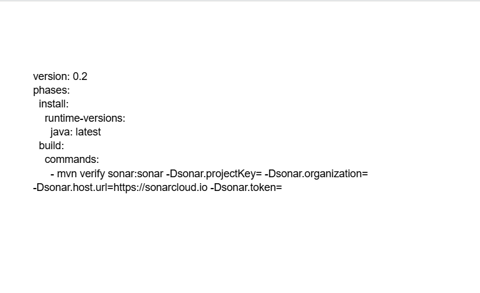

45. **Fill in Organization, Project Key, and Token**:   
Entered the SonarCloud organization key, project key, and token into the configuration.  
    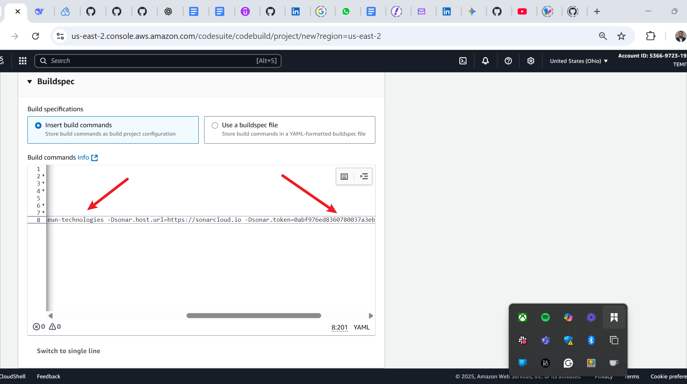

46. **Click CloudWatch and Build Project**:   
Enabled CloudWatch logging and created the build project.  
    

47. **Successfully Created Project Build**:   
Verified the successful creation of the build project.  
    

48. **Start Build**:   
Initiated the build process.  
    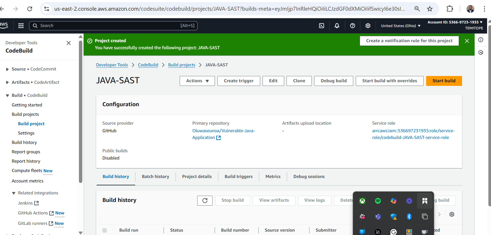

49. **Build Succeeded**:  
Confirmed the build completed successfully.  
    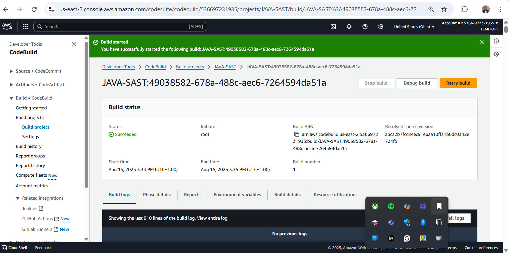

50. **Result Sent to Organization on SonarCloud**:   
Viewed the analysis results forwarded to the SonarCloud organization.  
    

51. **Analysis Result on SonarCloud**:  
Reviewed the detailed vulnerability and code quality report on SonarCloud.  
    

The provided screenshot displays the SonarCloud dashboard for the organization "seun-technologies" under the project "java-reachable-goof," reflecting the results of a Static Application Security Testing (SAST) scan conducted on August 15, 2025, at 3:34 PM WAT. Below is an interpretation of the results based on the visible metrics and status indicators:

### Result Overview
- **Organization and Project**: The dashboard (as shown on screenshot 50) belongs to the "seun-technologies" organization, which operates on a free plan with the key "seun-technologies." The project analyzed is "java-reachable-goof," set as a public project with the latest analysis completed on the specified date and time.
- **Quality Gate Status**: The project has passed the Quality Gate, indicated by the green checkmark ("Passed"). This suggests that the code meets the predefined quality and security thresholds set within SonarCloud.

### Detailed Metrics
The dashboard provides a breakdown of the project's quality across several categories: Quality Gate, Reliability, Security, Maintainability, and additional metrics like Hotspots Reviewed, Coverage, and Duplications.

1. **Quality Gate**:
   - **Status**: Passed (1 project passed, 0 failed).
   - **Interpretation**: The project adheres to the quality standards defined by the Quality Gate, which typically includes thresholds for bugs, vulnerabilities, code smells, and coverage. This is a positive outcome, indicating no critical issues that would block deployment or further development.

2. **Reliability**:
   - **A Rating**: 1 (no B, C, D, or E ratings).
   - **Bugs**: 0.
   - **Interpretation**: The project has an "A" rating for reliability, meaning no bugs were detected. This suggests the code is stable and free from functional errors that could affect its operation.

3. **Security**:
   - **A Rating**: 1 (no B, C, D, or E ratings).
   - **Vulnerabilities**: 8.
   - **Interpretation**: Despite an "A" rating, the project contains 8 security vulnerabilities. This is a notable concern, as the "A" rating likely reflects a lenient security threshold or weighting that still allows vulnerabilities to be present without failing the Quality Gate. These vulnerabilities could include issues like SQL injection or insecure dependencies, which should be investigated and remediated.

4. **Maintainability**:
   - **A Rating**: 0.
   - **B Rating**: 8.
   - **Code Smells**: 8.
   - **Interpretation**: The project has a "B" rating for maintainability, with 8 code smells identified. Code smells are indicators of potential issues in code structure or readability (e.g., duplicated code, complex methods) that could complicate future maintenance or refactoring. While not critical, addressing these could improve long-term code quality.

5. **Additional Metrics**:
   - **Hotspots Reviewed**: 0.0% (0 out of an unspecified total).
   - **Coverage**: 0.0% (0% test coverage).
   - **Duplications**: 0.0% (no duplicated code detected).
   - **Lines of Code**: 49 (XML, Java).
   - **Interpretation**: 
     - The 0.0% Hotspots Reviewed indicates no security hotspots (areas requiring manual review) have been addressed, which aligns with the presence of 8 vulnerabilities.
     - The 0.0% Coverage is a significant concern, indicating no unit tests are in place to verify the code’s behavior. This lack of test coverage increases the risk of undetected issues.
     - The 0.0% Duplications is positive, suggesting no redundant code, which supports maintainability.

### Overall Assessment
- **Strengths**: The project passes the Quality Gate, has no bugs, and shows no duplicated code. The small codebase (49 lines) and absence of reliability issues are also positive indicators.
- **Areas of Concern**: The presence of 8 security vulnerabilities, despite an "A" security rating, suggests that the threshold for failing the Quality Gate may be set too high or that some vulnerabilities are of lower severity. The 0.0% test coverage is a critical gap, increasing the risk of future issues, and the 8 code smells indicate room for code quality improvement.
- **Context**: Given the project’s focus on a "vulnerable Java application" (as per the project title), the detection of 8 vulnerabilities aligns with the expectation of a deliberately insecure codebase. The results validate the SAST pipeline’s ability to identify issues, though remediation is necessary for a production-ready application.

### If This is Your Application 
1. **Investigate Vulnerabilities**: Review the 8 identified security vulnerabilities in detail (available in the full SonarCloud report) and prioritize remediation based on severity (e.g., using OWASP Top 10 guidelines).
2. **Improve Test Coverage**: Develop and integrate unit tests to achieve non-zero coverage, reducing the risk of undetected bugs and vulnerabilities.
3. **Address Code Smells**: Refactor the code to eliminate the 8 code smells, enhancing maintainability and reducing technical debt.
4. **Adjust Quality Gate**: Consider tightening the Quality Gate thresholds to fail the build if vulnerabilities or code smells exceed acceptable limits.
5. **Manual Review of Hotspots**: Although no hotspots are reviewed, future scans may identify them; establish a process for manual review to complement automated SAST.

### Conclusion
The SonarCloud analysis confirms the SAST pipeline’s effectiveness in detecting vulnerabilities and code quality issues in the "java-reachable-goof" project. While the project passes the Quality Gate, the presence of 8 vulnerabilities and 0% coverage highlights areas for improvement. These results are consistent with the project’s goal of testing a vulnerable application, providing a solid foundation for further security enhancements and DevSecOps refinement. The analysis, conducted at 05:11 PM WAT on August 15, 2025, offers a snapshot of the current security posture, guiding next steps for remediation and testing.