# Vulnerable Java Application Basic Application Security Testing
**Author:** Oluwaseun Osunsola  
**Environment:** Windows GUI and CLI   

**Project link:** https://github.com/Oluwaseunoa/Cybersecurity-Projects/tree/main/Static-Application-Security-Testing/SAST101-Vulnerable-Java-Application%20Test

## Executive Summary  
This project focuses on performing basic Static Application Security Testing (SAST) on a vulnerable Java application using SonarCloud as the primary analysis tool. The application source code was sourced from GitHub, and AWS CodeBuild was utilized to automate the build and scanning process. The goal was to identify security vulnerabilities in the Java code through automated scanning, demonstrating a simple DevSecOps pipeline integration.

Key tools and services used:    
- **SonarCloud**: For code quality and security analysis.    
- **GitHub**: As the repository source and version control system.    
- **AWS CodeBuild**: For building the project and integrating with SonarCloud.    

The project involved setting up a SonarCloud organization and project, generating access tokens, cloning and preparing the vulnerable Java repository, connecting GitHub to AWS, and running a build to trigger the SonarCloud scan. The results highlighted vulnerabilities in the code, providing insights for remediation.

## Project Structure
The project directory structure is as follows:

```
C:.
└───SAST101-Vulnerable-Java-Application Test
    ├───app
    │   └───.jdk
    │       └───bin
    ├───gradle
    │   └───wrapper
    ├───img
    └───src
        └───main
            └───java
```

This structure indicates a Gradle-based Java application, with source code in `src/main/java`, build tools in `gradle`, and an embedded JDK in `app/.jdk`. The `img` folder contains screenshots documenting the execution steps.

## Step-by-Step Execution  
The project was executed in a sequential manner, starting with SonarCloud setup, followed by repository preparation on GitHub, and concluding with AWS CodeBuild integration and scanning. Each step is described below, with references to the corresponding screenshot in the `img` folder. The screenshot filenames directly describe the actions taken.

1. **Navigate to SonarCloud Login Page**:   
Accessed the SonarCloud website to begin the setup process.  
   

2. **Sign In with GitHub**:   
Selected GitHub as the authentication method for SonarCloud login.  
   

3. **Create Organization at Welcome Screen**:   
On the welcome screen, clicked the plus icon to create a new organization.  
   

4. **Create Organization Manually**:   
At the organization creation page, opted to create one manually.  
   

5. **Choose Organization Name and Key**:  
Entered the organization name and key for identification.  
   

6. **Select Free Plan and Create Organization**:   
Chose the free plan and finalized organization creation.  
   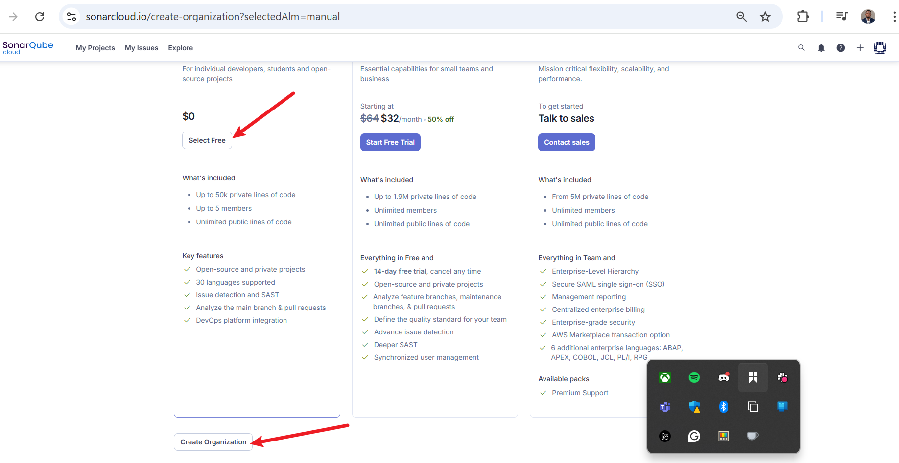

7. **Create Project in the Organization**:   
Within the newly created organization, initiated project creation.  
   

8. **Create Project Manually**:   
Selected the manual option for project setup.  
   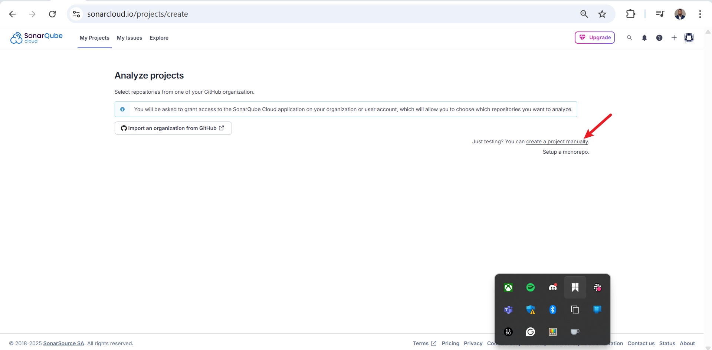

9. **Choose Display Name, Project Key, and Set to Public**:   
Specified the display name, project key, and set visibility to public.  
   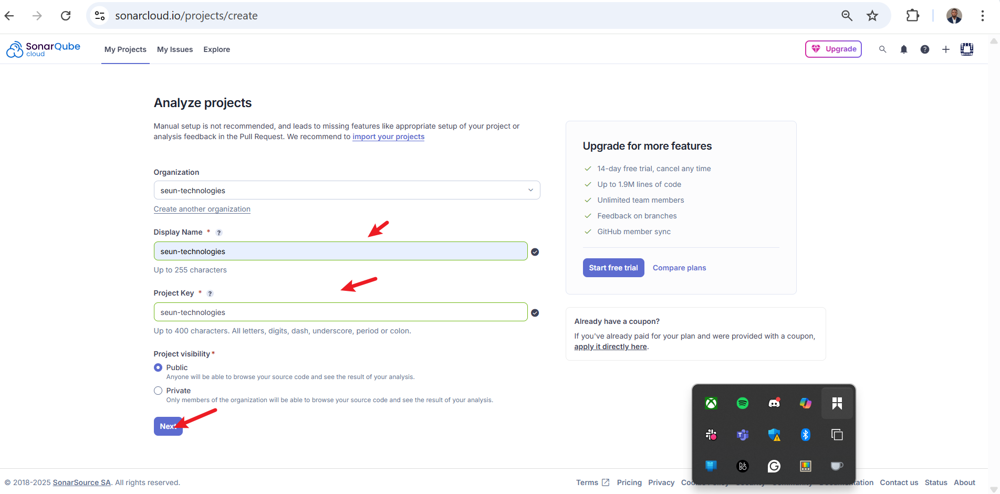

10. **Select Previous Version and Click Create Project**:   
Chose the previous version option and created the project.  
    

11. **Click on Account and My Account**:   
Accessed the account settings by clicking on the account menu and selecting "My Account".  
    

12. **Click on Security**:   
Navigated to the security section in account settings.  
    

13. **Enter Name, Generate Token, and Copy Generated Token**:   
Provided a name for the token, generated it, and copied the value.  
    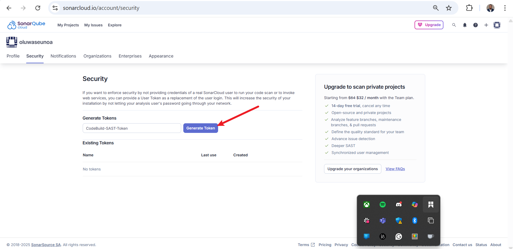

14. **Copy Generated Token (Not Visible Again)**:   
Noted and copied the token, as it would not be displayed again.  
    

15. **Locate Vulnerable Code Repository on GitHub and Copy HTTPS Link**:   
Found the vulnerable Java repository on GitHub and copied its HTTPS clone link.  
    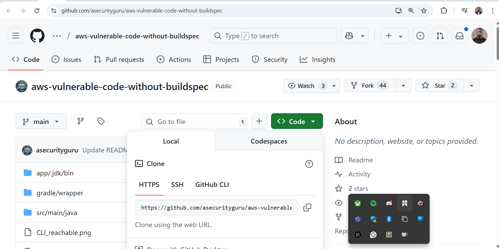

16. **Navigate to Desired Location and Clone Repository**:   
Moved to the local directory and cloned the repository using the copied link.  
    

17. **Create Project Folder**:   
Set up a new folder for the project.  
    

18. **Copy Content of Cloned Repository into Project Folder**:   
Transferred the cloned repository contents into the new project folder.  
    

19. **Create Repository in the Name of Project Folder on GitHub**:   
Created a new GitHub repository matching the project folder name.  
    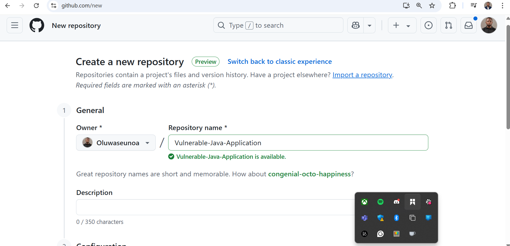

20. **Copy Repository Link from Quick Setup Section**:   
Copied the new repository's link from the quick setup area.  
    

21. **Initialize, Stage, Commit, and Push Repository to GitHub**:   
Initialized Git, staged files, committed changes, and pushed to the new GitHub repository.  
    

22. **Reload GitHub to Confirm Upload**:   
Refreshed the GitHub page to verify the upload was successful.  
    

23. **Log In to AWS Console**:   
Accessed the AWS Management Console with credentials.  
    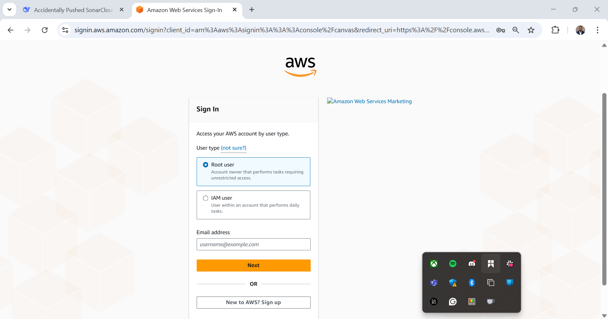

24. **Search for CodeBuild and Click on It**:   
Searched for "CodeBuild" in the AWS services and selected it.  
    

25. **Click on Create Project**:   
Initiated the creation of a new build project.  
    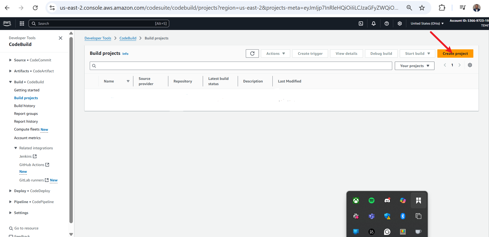

26. **Name the Project and Scroll Downward**:   
Assigned a name to the project and proceeded downward.  
    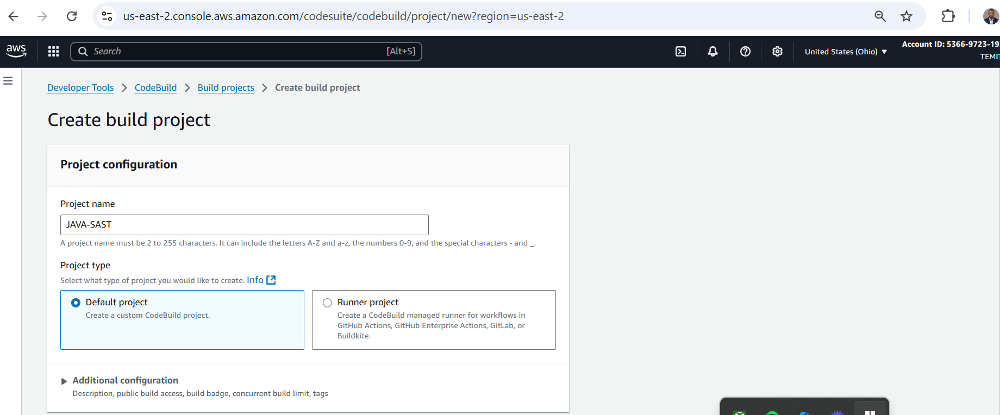

27. **Select GitHub as Source Provider and Click on Manage Credentials**:  
Chose GitHub as the source and managed credentials.  
    

28. **Click Create New GitHub Connection**:   
Started the process to create a new connection to GitHub.  
    

29. **Create GitHub App Connection**:   
Set up the GitHub app connection.  
    

30. **Click Connect to GitHub**:   
Connected the AWS account to GitHub.  
    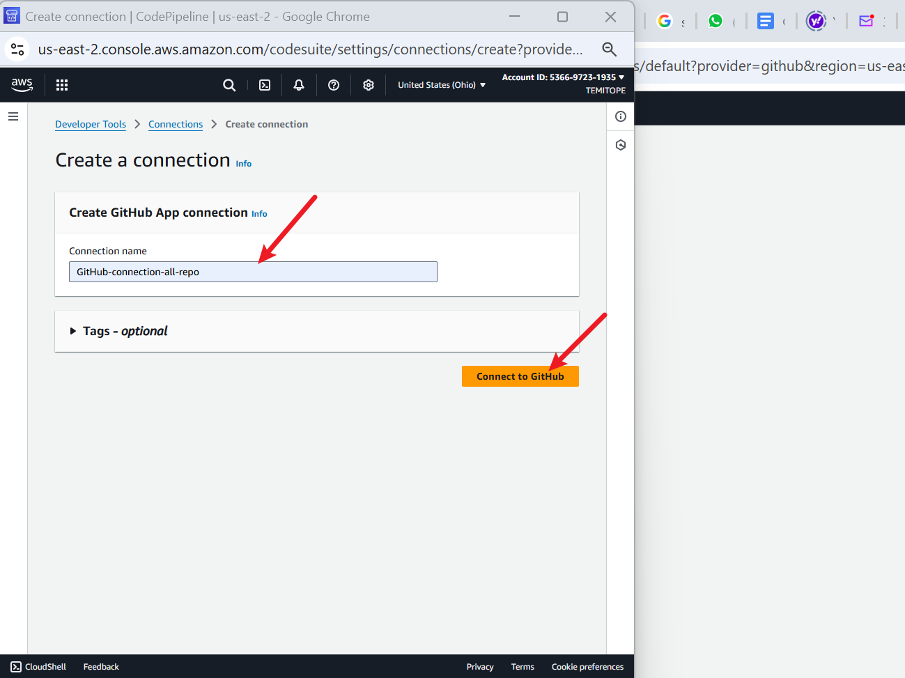

31. **Click Install a New App**:   
Installed a new GitHub app for integration.  
    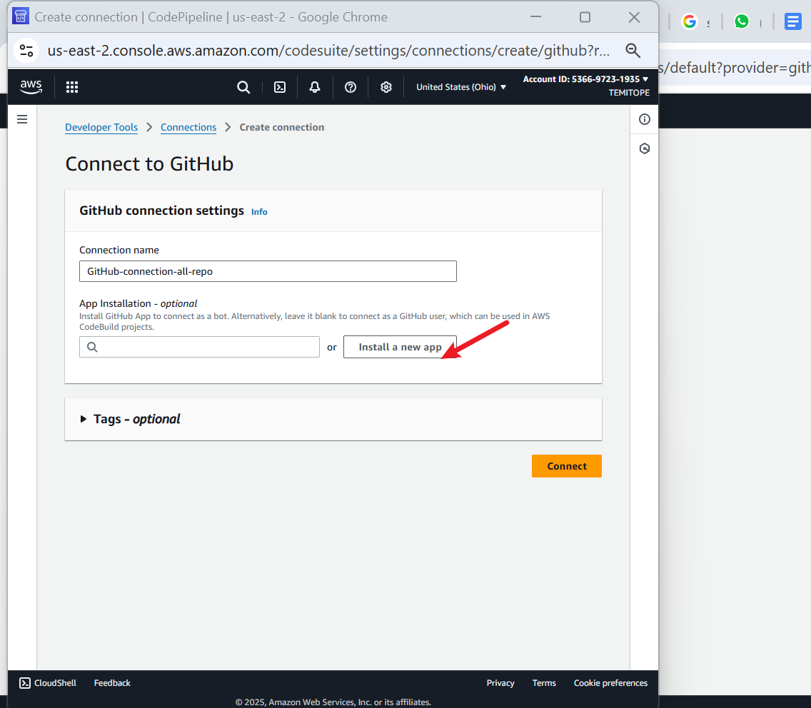

32. **Click on GitHub Profile with Username**:   
Selected the GitHub profile associated with the account username.  
    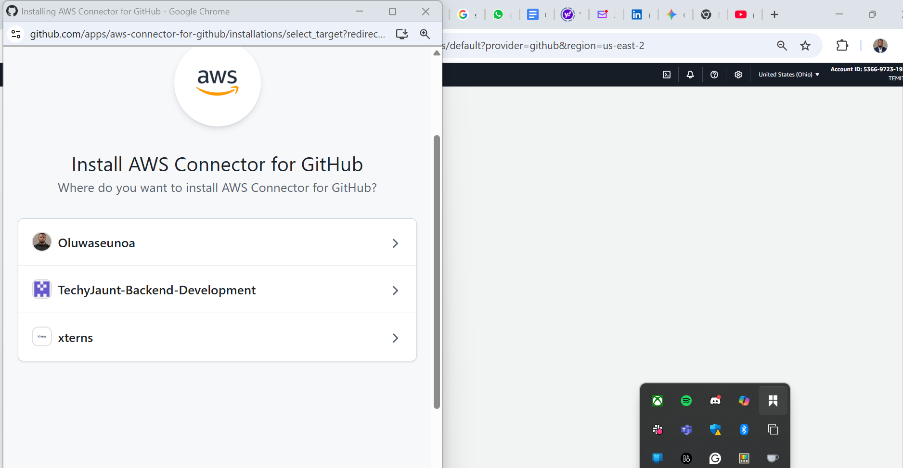

33. **Authorize for All Repositories or Some**:   
Granted authorization for all or selected repositories.  
    

34. **Authenticate with Device (If 2FA Enabled)**:   
Completed device authentication for two-factor setup.  
    

35. **Confirm Identity by Supplying Number Sent**:   
Entered the verification code sent for identity confirmation.  
    

36. **Click Connect After App Installation**:   
Finalized the connection post-installation.  
    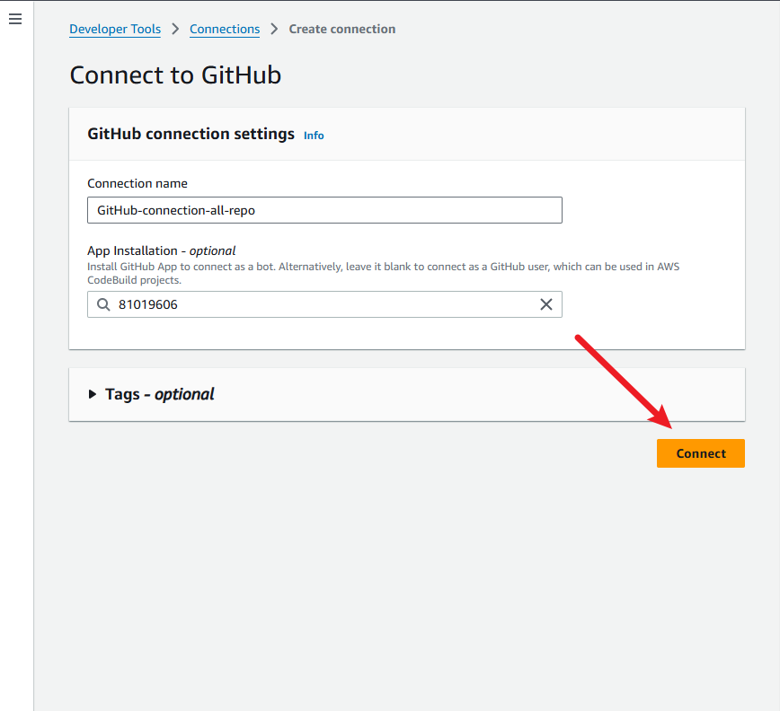

37. **Select the New Connection**:   
Chose the newly created GitHub connection.  
    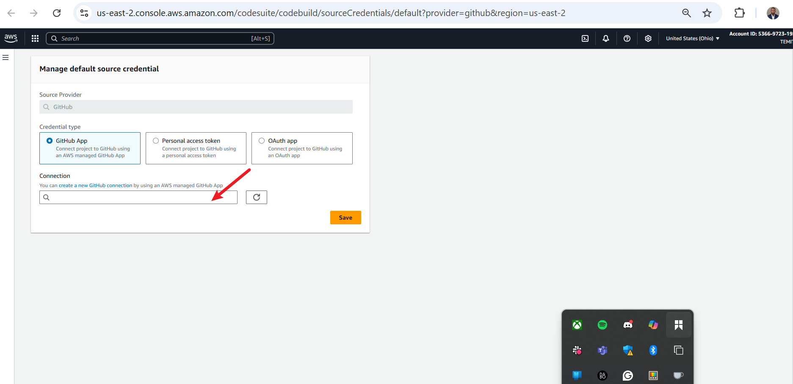

38. **Click Save**:   
Saved the connection settings.  
    

39. **Account Now Connected to GitHub**:   
Confirmed the successful connection between AWS and GitHub.  
    

40. **Select from GitHub Repository and Choose Your Repository**:   
Picked the project repository from the GitHub sources.  
    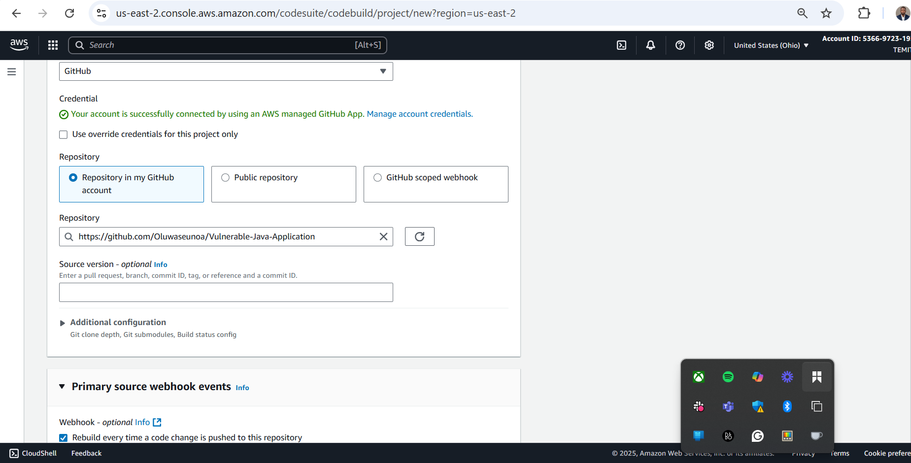

41. **Leave Default OS Type and Spec**:   
Retained the default operating system type and specifications for the build environment.  
    

42. **Leave Default System and Runtime Under Environment**:   
Kept the default system and runtime settings in the environment configuration.  
      <!-- Note: Filename appears to have a typo in "system" -->

43. **Under Buildspec, Select Insert Build Command and Switch to Editor**:   
In the buildspec section, chose to insert commands and switched to the editor mode.  
    

44. **Paste Commands to the Text Editor**:   
Inserted the necessary build commands into the editor.  Find it [here](https://github.com/asecurityguru/aws-devsecops-repo-for-buildspec-with-sonarcloud-actualvalues/blob/main/buildspec.yml)
    

45. **Fill in Organization, Project Key, and Token**:   
Entered the SonarCloud organization key, project key, and token into the configuration.  
    

46. **Click CloudWatch and Build Project**:   
Enabled CloudWatch logging and created the build project.  
    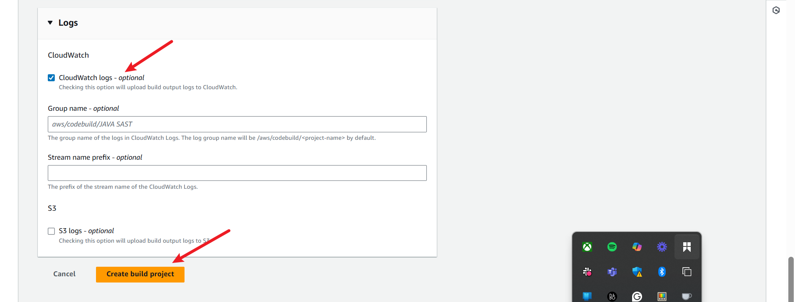

47. **Successfully Created Project Build**:   
Verified the successful creation of the build project.  
    

48. **Start Build**:   
Initiated the build process.  
    

49. **Build Succeeded**:  
Confirmed the build completed successfully.  
    

50. **Result Sent to Organization on SonarCloud**:   
Viewed the analysis results forwarded to the SonarCloud organization.  
    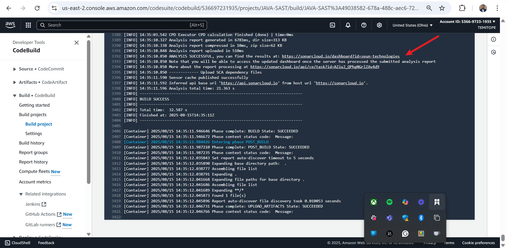

51. **Analysis Result on SonarCloud**:  
Reviewed the detailed vulnerability and code quality report on SonarCloud.  
    

## Results and Analysis  
The SonarCloud scan identified various vulnerabilities in the Java application, such as potential SQL injection risks, insecure dependencies, and code smells. The integration via AWS CodeBuild ensured automated scanning on code pushes, aligning with SAST best practices. Key metrics from the analysis included vulnerability counts, security hotspots, and code coverage suggestions.

## Conclusion and Recommendations  
This project successfully demonstrated a basic SAST pipeline for a vulnerable Java application using SonarCloud, GitHub, and AWS CodeBuild. Future enhancements could include integrating dynamic analysis tools, automating remediation workflows, or expanding to containerized builds. Regular scans are recommended to maintain application security. All steps were documented via screenshots for reproducibility.